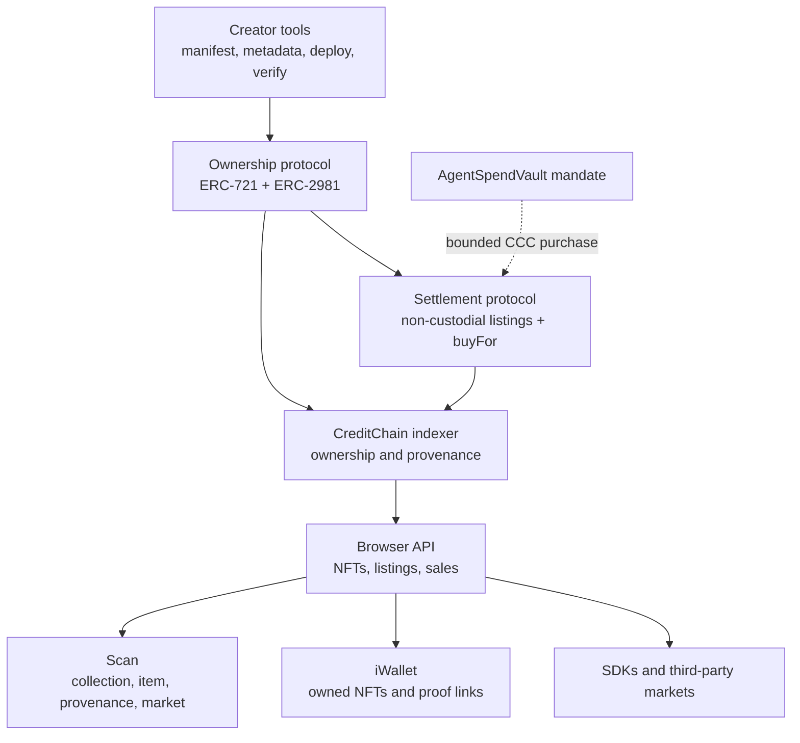

# CreditChain NFT Ecosystem — Vision, Architecture, and Launch Plan

**Status:** product and engineering plan of record
**Updated:** 2026-08-09
**Launch posture:** public testnet first; mainnet trading is gated
**Product name:** CreditChain NFTs / CreditChain Market

## 1. Executive decision

CreditChain should not try to win by becoming another image marketplace with a
different logo. It should become the most trustworthy infrastructure for
creating, proving, programming, discovering, and exchanging digital ownership.

The wedge is **ownership with evidence**:

- creator and collection provenance that can be independently checked;
- explicit rights, storage, royalty, and mutability disclosures;
- non-custodial exchange with listings and settlement emitted as public events;
- explorer-native verification of every ownership and market claim;
- wallet-native discovery rather than a marketplace-controlled portfolio;
- agent-native purchasing through bounded mandates without giving an agent keys
  or letting it take custody of the asset.

The first implementation is an integrated market surface in CreditChain Scan at
`/market`, not a new repository or database-driven storefront. This is
intentional: liquidity and evidence should begin in one place. The marketplace
protocol is independent, and the UI can move to `market.creditchain.org` when
traffic, merchandising, or release cadence justifies a separately deployed app.

## 2. North star

> Any person or agent can understand what an NFT represents, who created it,
> what rights travel with it, who owns it, how it was sold, and what code will
> execute—before signing.

“Best in the world” means leading this scorecard, not claiming the largest
headline volume:

| Dimension | CreditChain target |
|---|---|
| Provenance | Origin manifest, content hashes, mint evidence, and complete transfer trail visible together |
| Safety | No marketplace custody; exact transaction preview; stale-listing checks; pull payouts; rapid purchase pause |
| Openness | ERC standards, portable metadata, public APIs, verified contracts, no catalog lock-in |
| Creator quality | Clear rights, durable storage, royalty disclosure, analytics, verified collection identity |
| Ownership experience | The same live asset state in Scan, iWallet, APIs, and market |
| Agent readiness | Buy-for-recipient and mandate-controlled purchasing without agent custody |
| Reliability | Multi-node PoS finality, indexer SLOs, multi-gateway metadata, tested incident response |
| Developer speed | First collection in under 30 minutes; first indexed mint in under one block plus index lag |

## 3. Product principles

1. **The chain is the source of truth.** The market catalog is derived from
   signed contract events, not an editable private listing table.
2. **NFTs never enter marketplace custody.** Approval is permission to settle a
   valid listing, not a deposit.
3. **Metadata failure must not erase ownership.** Scan and iWallet show contract,
   token ID, owner, blocks, transactions, and provenance even when IPFS/HTTP is
   unavailable.
4. **Disclose mutability.** A mutable collection is not necessarily bad, but it
   must never masquerade as frozen.
5. **Rights are part of the product.** The UI should show the declared license,
   commercial rights, content hash, and storage policy before purchase.
6. **Royalties are transparent.** ERC-2981 is a royalty signal; the CreditChain
   market accounts for it at settlement, while external markets may choose
   different enforcement.
7. **Safety beats feature count.** Fixed-price ERC-721 comes before offers,
   auctions, bundles, loans, rentals, or bridges.
8. **Mainnet is earned.** Testnet usage, audits, PoS finality, operations, and
   custody review are release gates—not roadmap decoration.

## 4. Architecture

### 4.1 Ownership protocol

The testnet reference `CreditNFTCollection` implements ERC-721 metadata and
ERC-2981 royalties with:

- creator-controlled minters;
- a hard maximum mint count;
- collection and per-token metadata URIs;
- a collection-level provenance hash;
- a 10% royalty ceiling in the reference implementation;
- two-step ownership transfer;
- permanent collection freeze that closes minting and all metadata, minter, and
  royalty changes;
- no proxy or upgrade authority.

It also advertises ERC-4906 metadata-update support and ERC-7572-style
collection metadata updates. `CreditNFTFactory` is a permissionless, fee-free,
non-upgradeable launchpad: it has no owner and transfers all collection control
to the creator at construction. An official-factory badge proves deployment
origin, while source verification remains a separate, stronger bytecode claim.

This contract is a reference and launchpad primitive, not a promise that every
collection must use one template. Scan should verify and profile any conformant
ERC-721 collection.

### 4.2 Settlement protocol

`CreditNFTMarket` v1 is a native-CCC, exact-price, non-custodial ERC-721 market:

- sellers keep NFTs until settlement;
- ownership and approval are checked at listing and again at purchase;
- one active listing per asset prevents ambiguous orders;
- expired, transferred, or unapproved listings can be pruned by anyone;
- ERC-2981 royalty, market fee, and seller proceeds are calculated on-chain;
- recipients withdraw proceeds with a pull-payment design;
- the market fee is capped at 2.5% by code;
- purchases can be paused without blocking cancellation or withdrawal;
- `buyFor(listingId, recipient)` separates payer from final owner.

The last item is strategically important. A policy-bound agent can pay for a
license, membership, game item, or creative work and deliver it directly to the
human or organization it serves.

### 4.3 Evidence and data plane

The indexer distinguishes the shared ERC-20/ERC-721 `Transfer` signature using
the indexed token-ID topic. It stores NFT token ID separately from fungible
amount, reconstructs current ownership from the latest event, and indexes the
market's `Listed`, `ListingCancelled`, `ListingInvalidated`, and `Sale` events.
Market and factory event sources are fail-closed behind separate operator
allowlists; matching a public event signature is not treated as proof that a
contract is official. The curated public market feed also requires the listed
collection to have source-verified bytecode or factory provenance in Scan; the
ownership index itself remains open to every conformant ERC-721.

Public API surface:

- `GET /v1/nfts?owner=&contract=&limit=&offset=`
- `GET /v1/nfts/:contract/:token_id`
- `GET /v1/nfts/:contract/:token_id/metadata`
- `GET /v1/nft-media?uri=`
- `GET /v1/nft-collections?verified=&contract=&limit=&offset=`
- `GET /v1/nft-collections/:contract`
- `GET /v1/nft-market/listings?status=&owner=&limit=&offset=`
- `GET /v1/nft-market/config`

Ownership reads remain useful without metadata. The metadata resolver only
dereferences content-addressed IPFS/Arweave locations or bounded inline JSON.
It rejects arbitrary HTTP fetches, redirects, SVG, unknown media types, JSON
over 256 KiB, and media over 8 MiB. The media proxy adds MIME checks,
`nosniff`, bounded caching, and a deterministic fallback when resolution fails.

### 4.4 Product surfaces

- **Official web:** `/nfts` owns the thesis, standards, safety posture, roadmap,
  and creator acquisition funnel.
- **Scan:** `/nfts`, NFT detail pages, `/market`, transaction evidence, contract
  verification, collection discovery, `/market/create`, safe media, native
  sharing, and wallet-driven testnet purchases.
- **iWallet:** real owned-NFT discovery from the Browser API, deterministic
  placeholders when media is unavailable, and deep links to independent proof.
- **Creator tooling:** a wallet-native Creator Studio for launch, mint, approve,
  list, cancel, withdraw, and freeze; Foundry reference scripts; verification;
  and a step-by-step public tutorial.

## 5. Market design beyond v1

### Release 1 — evidence-first fixed price (implemented locally)

- ERC-721 minting and royalties;
- native CCC listings;
- exact-price purchase and buy-for-recipient;
- indexed inventory, ownership history, listings, and sales;
- wallet purchase from Scan;
- mobile owned-NFT discovery;
- creator quickstart.

### Release 2 — creator operating system (core implemented locally)

- permissionless creator-owned factory and indexed collection registry;
- signed creator profile and links;
- SSRF-safe metadata/media resolver; trait indexing remains next;
- license and commercial-rights profile;
- collection-level analytics and holder distribution;
- multisig launchpad administration;
- allowlist/public mint modules separated from the base collection;
- moderation labels that never rewrite chain history.

### Release 3 — open liquidity protocol

Move order discovery off-chain while retaining on-chain settlement. The order
format should be Seaport-compatible where practical instead of inventing an
isolated liquidity language. Add only after audit:

- EIP-712 signed listings and offers with nonce cancellation;
- collection and trait offers;
- ERC-1155 single and batch indexing/trading;
- English and Dutch auctions as isolated modules;
- aggregation API and external market adapters;
- creator royalty policy made explicit per venue;
- MEV, signature replay, cancellation-race, and fee-on-transfer threat tests.

### Release 4 — programmable ownership

- ERC-6551 token-bound accounts for assets that own assets or permissions;
- ERC-4907 time-bound user rights for rentals and access;
- brand and game SDKs;
- rights and credential registries;
- mandate-governed acquisition budgets and allowlisted collections;
- reputation and provenance signals for autonomous buyers.

Bridged NFTs are deliberately late. A bridge multiplies custody and canonical-
asset risk; it should not be used to manufacture early liquidity.

## 6. Trust and safety model

### Contract risks addressed in v1

- reentrancy guard around purchase and withdrawal;
- checks-effects-interactions ordering;
- exact native payment rather than refund callbacks;
- pull-based proceeds so a hostile recipient cannot block a sale;
- royalty plus market fee cannot exceed price;
- hard market-fee ceiling;
- stale owner/approval checks;
- expiry at purchase time;
- cancellation and withdrawal available during pause;
- two-step administration;
- no upgrade proxy.

### Required before public testnet promotion

- independent Solidity review and automated static analysis;
- property/invariant tests for conservation of CCC, unique active listings, and
  “sale implies recipient ownership”;
- adversarial ERC-721 receiver and royalty contracts;
- indexer replay tests from mint through sale, cancel, burn, and reorg;
- metadata fetcher threat model before remote media is enabled;
- signed deployment record, verified source, and admin/fee recipient disclosure;
- monitoring for stale indexer head, failed event decoding, and proceeds balance.

### Required before mainnet trading

All global mainnet readiness gates still apply, including the PoS migration and
soak, multi-node/multi-site reliability, compromised genesis-account resolution,
chain and contract audits, documented custody of administrative accounts,
multisig controls, incident pause rehearsal, and public disclosure. Mainnet
must not be enabled merely because the UI is ready.

## 7. Go-to-market

### 7.1 Beachhead

Start where CreditChain's differentiation is strongest:

1. **AI-assisted creators who need credible origin.** A signed origin manifest
   and content hash answer the “who made this and when?” problem better than a
   generic mint page.
2. **Independent games and digital goods.** Low-cost EVM execution, ERC-1155 in
   the next protocol release, rentals later, and agent-compatible purchases form
   a coherent product—not a speculative campaign.
3. **Agent commerce licenses and memberships.** An agent can acquire a bounded
   right for its principal while the proof and recipient are visible on-chain.

Avoid positioning NFTs as investments or promising appreciation. Lead with
ownership, provenance, access, rights, and programmable utility.

### 7.2 Founding network program

Recruit a small, high-signal cohort before opening a permissionless launchpad:

- 25 founding visual/music creators;
- 10 indie game or digital-goods teams;
- 5 agent-commerce experiments;
- one public testnet collection per participant;
- hands-on metadata, rights, and security review;
- weekly demo day with provenance and build walkthroughs;
- permanent “Genesis Creator” profile based on participation, not volume.

CreditChain supplies testnet gas, engineering office hours, verification, launch
pages, and evidence analytics. Creators keep their work, contracts, audiences,
and portable metadata.

### 7.3 Growth loops

- Every minted asset links to a readable provenance page.
- Every proof page links to the creator's collection and public build guide.
- Every iWallet asset links back to Scan, creating verification habit.
- Open APIs let games, galleries, and agents display the same ownership truth.
- Creator launch retrospectives become technical content and ecosystem proof.
- Collection verification rewards excellent disclosure, not paid promotion.

### 7.4 Distribution

- Publish the NFT quickstart and a 15-minute video build.
- Run a testnet “Proof of Origin” season with weekly curated drops.
- Provide starter kits for generative art, game items, memberships, and agent
  licenses.
- Partner with digital art schools, indie-game communities, creative coding
  groups, and AI creator tools.
- Offer marketplace/indexer APIs to third-party storefronts instead of forcing
  every community into the CreditChain UI.

### 7.5 Metrics that matter

| Funnel | Metric |
|---|---|
| Build | time to first verified collection; tutorial completion; deploy failure rate |
| Quality | percentage with content-addressed media, rights profile, provenance hash, frozen metadata |
| Ownership | unique active collectors; repeat collectors; wallet discovery success |
| Market | valid listings, settlement success, stale-listing rate, royalty payout success |
| Reliability | index lag p95, metadata availability, API error rate, chain finality incidents |
| Ecosystem | third-party API consumers, game/agent integrations, portable order flow |

Raw volume, floor price, and wash-trading-sensitive rankings are secondary and
must never be the sole definition of traction.

## 8. Implementation and launch sequence

### Now — local release candidate complete

- reference collection and non-custodial market contracts;
- 18 focused factory/market/collection tests, including empty-provenance, hostile royalty, and receiver cases;
- mainnet-blocked creator and operator Foundry deployment scripts;
- ERC-721-aware indexer and NFT/listing schema migration;
- Browser API ownership, collection, safe metadata/media, configuration, and market routes;
- Scan NFT inventory, collection discovery, rich proof detail, Creator Studio,
  native sharing, and wallet-driven market;
- official NFT product page and public quickstart;
- iOS and Android replacement of mock galleries with live indexed ownership.

### Next — testnet release candidate

1. Add invariant/adversarial contract tests and external review.
2. Apply the browser migration in a testnet clone and replay from the chosen NFT
   deployment block.
3. Deploy with fresh testnet-only administrator and fee-recipient accounts.
4. Verify contract sources and publish addresses in the canonical network
   registry; do not hardcode unverified addresses in clients.
5. Execute mint → list → buyFor → withdraw → cancel → invalidate → burn journeys.
6. Redeploy indexer/API/UI, then run iOS and Android device checks.
7. Begin the founding creator program and collect usability/security reports.

### 30–90 day hardening

- trait indexing, signed creator profiles, and creator analytics;
- ERC-1155 index and display;
- collection verification policy and moderation appeals;
- signed-order protocol design and audit scope;
- load/reorg/chaos tests;
- product analytics with privacy-minimized events;
- third-party SDK examples;
- mainnet launch checklist integrated with `deploy/MAINNET-READINESS.md`.

## 9. What is not claimed yet

- The NFT contracts are not audited.
- No NFT contracts were deployed by this implementation pass.
- Mainnet NFT trading is not enabled.
- Metadata resolution intentionally excludes mutable arbitrary HTTP origins and SVG.
- v1 does not support ERC-1155, offers, auctions, bundles, rentals, token-bound
  accounts, cross-chain bridges, or signed off-chain orders.
- “Best NFT infrastructure” is the objective and scorecard—not current market
  status.

Those boundaries are product integrity. Each disappears only when evidence says
the corresponding capability is safe and real.
