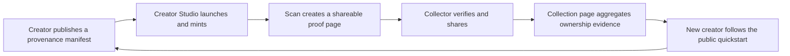

# CreditChain NFTs — Go-to-Market Playbook

**Campaign:** Proof of Origin, Season Zero
**Status:** testnet launch candidate; no mainnet trading
**Updated:** 2026-08-09

## The market position

CreditChain will not market NFTs as a shortcut to speculation. The product is
**ownership with evidence**: durable provenance, explicit creator commitments,
portable standards, visible settlement, and wallet-native proof.

The category claim is:

> The fastest way to launch digital ownership that a collector, game, brand,
> institution, or AI agent can independently verify.

The initial wedge is creators and small teams whose reputation depends on
showing what was made, by whom, under which terms, and how ownership changed.

## Season Zero offer

Recruit 40 founding testnet projects:

- 20 AI-assisted visual, music, and creative-code creators;
- 10 indie game or digital-goods teams;
- 5 membership, ticket, or learning-pass experiments;
- 5 agent-commerce licenses or machine-purchasable resources.

CreditChain provides test CCC, weekly office hours, provenance/metadata review,
source verification, a collection page, a launch retrospective, and API help.
Creators retain their contracts, media, identity, audience, and rights.

Participation never requires paid promotion, exclusivity, or financial claims.
The “Founding Creator” marker recognizes completed build evidence, not volume.

## The viral product loop

Each loop has a product hook:

1. **Launch receipt:** share collection address, creator, provenance commitment,
   max supply, and factory origin.
2. **Mint receipt:** share media, content hash, owner, metadata status, and mint
   transaction on one page.
3. **Ownership receipt:** after a transfer or sale, share the same canonical URL
   with updated owner and full history.
4. **Collection proof:** turn every asset share into discovery for the creator's
   full body of work.
5. **Build fork:** every proof page leads to a public tutorial and Creator Studio.

Do not use floor-price alerts, artificial countdowns, fake scarcity, wash-volume
leaderboards, or “investment” language. Virality must come from identity,
utility, craft, and verifiable participation.

## Launch calendar

### Days 1–7 — prove the release

- deploy factory, collection implementation, and market to testnet with fresh
  hardware-controlled operator accounts;
- publish deployment receipts, verified source, admin/fee disclosures, and
  market configuration;
- replay launch → mint → list → buyFor → withdraw → cancel → invalidate → burn;
- run adversarial contract tests, indexer replay, metadata abuse corpus, and
  mobile device checks;
- keep `CC_NFT_TRADING_ENABLED=false` until the signed release checklist passes.

### Days 8–14 — private creator cohort

- onboard five design partners through the public Creator Studio;
- measure time-to-first-mint, wallet rejection points, metadata resolution, and
  support burden;
- interview every participant after launch and ship the top three blockers;
- publish the first transparent build retrospective, including failures.

### Days 15–21 — Proof of Origin week

- release one founding collection per day with a creator story and provenance
  walkthrough;
- host a live “verify before you collect” session using Scan rather than slides;
- invite creative-coding, indie-game, digital-art-school, and AI-tool communities;
- give partners API examples to render the same ownership state independently.

### Days 22–30 — open testnet season

- open the fee-free launchpad to all testnet wallets;
- publish starter manifests for art, game items, membership, learning
  credentials, and agent licenses;
- add weekly collection spotlights selected for disclosure quality and utility,
  never paid volume;
- publish the Season Zero scorecard and a prioritized public roadmap.

## Channels and messages

| Audience | Message | Proof asset | Primary CTA |
|---|---|---|---|
| Creators | Own the contract, publish the origin | Factory receipt + manifest hash | Launch on testnet |
| Collectors | Verify before you sign | NFT proof page + ownership trail | Inspect a collection |
| Games | Portable items on familiar EVM rails | API + wallet discovery | Build a pilot |
| Brands/institutions | Disclosed rights and auditable custody | Collection profile + verified source | Run a controlled drop |
| Agent builders | Buy for a principal without sharing keys | `buyFor` + mandate demo | Build agent commerce |
| Developers | Open contracts, events, and APIs | Quickstart + source | Fork the reference stack |

Content should demonstrate a real signed action, a readable proof page, or a
working integration. Avoid generic “future of NFTs” announcements.

## Metrics and decision rules

### Activation

- median creator time from connect to indexed mint under 15 minutes;
- at least 70% of started launches reach an indexed mint;
- at least 90% of launch metadata is content-addressed and resolvable;
- fewer than 5% of wallet actions require support intervention.

### Trust

- 100% of promoted collections disclose creator, rights, mutability, storage,
  royalty, and provenance;
- 100% of official market and factory addresses are allowlisted and published;
- zero arbitrary-origin metadata fetches from Browser API infrastructure;
- zero unresolved Critical/High contract findings before trading is enabled.

### Retention and distribution

- 30-day returning-creator rate;
- unique holders and repeat collectors, excluding known self-transfers;
- proof-page share-to-visit and visit-to-Creator-Studio conversion;
- third-party API clients and completed game/agent integrations;
- collection-page traffic that comes from individual ownership receipts.

Volume is reported with unique counterparties and self-trade heuristics. It is
never the primary success metric or a basis for promotional ranking.

## Mainnet release rule

An attractive website is not evidence of mainnet readiness. Mainnet NFT launch
requires all chain-wide gates plus NFT-specific contract audit, deployment
ceremony, multisig controls, signed address registry, metadata abuse testing,
indexer replay/reorg testing, purchase-pause rehearsal, proceeds reconciliation,
and a public risk disclosure. Until then:

- no mainnet NFT contract deployment;
- no mainnet market allowlist;
- no `CC_NFT_TRADING_ENABLED=true` on mainnet;
- no language implying that testnet CCC or NFTs have monetary value.
